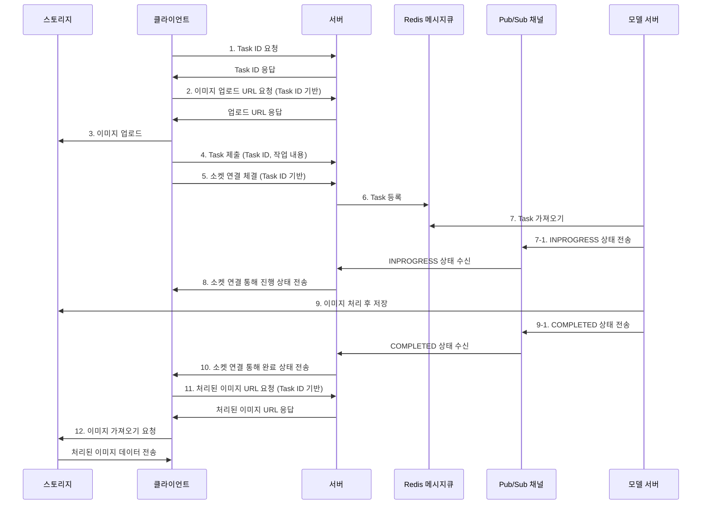

# 색담 - AI를 통해 벽화를 색다르게

  <a href="https://splashy-band-e63.notion.site/SKT-FLY-AI-6-1778ab91c32080a5b396f4809387d475" target="_blank">팀 노션</a> | <a href="https://github.com/typingmistake/saekdam-be">백엔드 레포</a> | <a href="https://github.com/typingmistake/saekdam-web-fe">프론트엔드 웹 레포</a> | <a href="https://github.com/SKFLY-FINAL-PROJECT-6/saekdam-app-fe">프론트엔드 앱 레포</a>

---

## 📋 프로젝트 소개

색담은 인공지능 기술을 활용하여 낡은 벽에 요구사항을 반영한 새로운 색을 칠하고, 결과물을 공유할 수 있는 서비스입니다. 

스테이블 디퓨전 모델 베이스로, 벽화의 느낌을 살리기 위해 LoRA기법의 학습을 진행했습니다.

---

### 🖥️ 주요 페이지 구조

<table>
  <tr>
    <td align="center"><b>메인페이지</b>  서비스 소개 및 주요 기능 안내</td>
    <td align="center"><b>게시판 페이지</b>  사용자 작업 및 커뮤니티 게시물</td>
    <td align="center"><b>게시물 페이지</b>  개별 게시물 상세 내용</td>
  </tr>
</table>

### 🤖 소켓 활용 작업 프로세스 모니터링

<table>
  <tr>
    <td align="center"> <b>0. 테마 지정</b></td>
    <td align="center"> <b>0. 프롬프트 입력</b></td>
    <td align="center"><b>1. 작업 대기중</b> </td>
    <td align="center"><b>2. 작업 진행중</b> </td>
    <td align="center"><b>3. 작업 완료</b> </td>
  </tr>
</table>

---

## 🔧 주요 기술적 고민사항
- [BastionHost 대신 SSM을 사용해보자](https://splashy-band-e63.notion.site/BastionHost-SSM-19b8ab91c32080a0a155d73f90d6b5c7)
- [Redis와 ws를 활용한 AI 작업 모니터링](https://splashy-band-e63.notion.site/Redis-ws-AI-19f8ab91c320802b831eebce460deb1e)
- [객체 버킷과 PreSigned URL](https://splashy-band-e63.notion.site/PreSigned-URL-19b8ab91c320804faecbfbe964240faf)
- [Stable Diffusion 모델 LoRA 적용 과정](https://splashy-band-e63.notion.site/Stable-Diffusion-LoRA-1a08ab91c320804ba27ccc635cb3a2bb)

---

## 🔄 AI 작업 주요 시퀀스

---

## 🏗️ 시스템 아키텍처

---

## 📅 세부 개발 일정

| 단계 | 기간 | 활동 | 비고 |
|:----|:-----|:-----|:-----|
| **사전기획** | 1/6(월) ~ 1/14(화) | 프로젝트 기획 및 주제 선정 | 아이디어 선정 |
| **데이터 수집** | 1/15(수) ~ 1/20(월) | 시장 조사, 학습 데이터 수집 | 크롤링, 오픈 데이터셋 |
| **데이터 전처리** | 1/21(화) ~ 1/23(목) | 데이터 정제 | - |
| **모델링** | 1/24(금) ~ 1/31(금) | 세그멘테이션, 생성형 모델 구현 | 모델 성능 평가 |
| **서비스 구축** | 1/14(화) ~ 2/21(금) | 백엔드, 모바일, 웹 서비스 구현 | - |
| **테스트 및 배포** | 2/24(월) ~ 2/28(금) | 베타 테스트 및 사용자 피드백 | - |

## 구성원 소개

